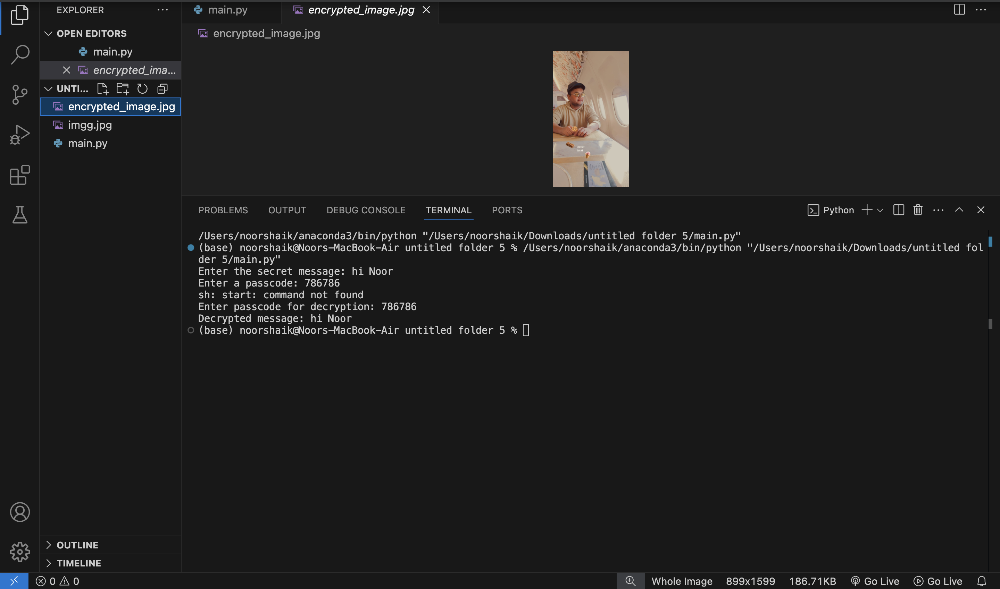

# Secure-Data-Hiding-in-Images-using-Steganography
## 🔒 Image Steganography Using OpenCV

## 📌 Project Overview  
This project allows users to **hide secret messages inside images** using **OpenCV** in Python. The message is embedded into pixel values and can only be retrieved using the correct passcode.

---

## 🚀 Features  
✅ **Embed secret messages into images securely**  
✅ **Passcode-protected message retrieval**  
✅ **Works with multiple image formats (JPG, PNG, BMP)**  
✅ **Simple and efficient pixel-based encoding**  

---

## 🛠️ Technologies Used  
- **Python 3.x**  
- **Libraries:**  
  - `OpenCV` – Image processing  
  - `os` – File handling  

---

## 📌 Installation & Setup  

### 🔹 Prerequisites  
Make sure you have **Python 3.x** installed. Install required dependencies:  

"pip install opencv-python "

## 📌 How to Use

### 🔹 Encoding (Hiding a Message in an Image)
Place your input image in the images/ folder.

* Run the script:
"python main.py"  

* Enter the secret message you want to hide. 

* Set a passcode to protect the message. 

* The script will embed the message into the image and save the stego-image (with the hidden data).

### 🔹 Decoding (Retrieving a Hidden Message)
* Run the script again:
"python main.py"
* Load the stego-image (the image containing hidden data).
* Enter the passcode you used during encoding.
* The script will extract and display the hidden message.

## 📎 Example Usage

### Encoding Process
* Enter the secret message: Hello, this is a hidden message!
* Enter a passcode: 1234
* Message embedded successfully! Stego-image saved in encoded_images/.

  
### Decoding Process
* Enter passcode to retrieve the message: 1234
* Decoded Message: Hello, this is a hidden message!

## 📌 Future Enhancements

* 🔐 Stronger Security – Add encryption before embedding messages.
* 🧠 AI-Based Optimization – Improve message encoding using AI techniques.
* 📹 Video Steganography – Extend functionality to hide messages in videos.
* 📂 Web Interface – Build a web-based GUI using Flask or Django.

  
# RESULTS

# THANK U ❤️
